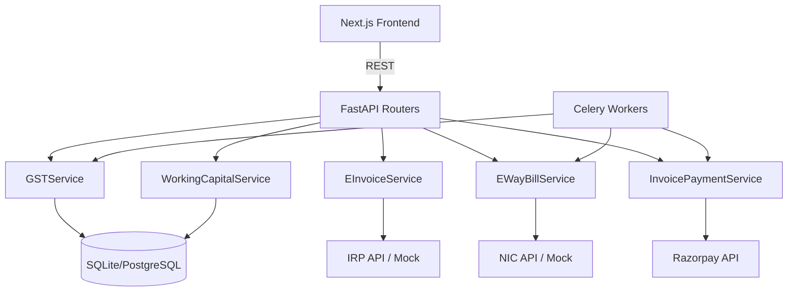

# Design Document: Phase 4 — GST Compliance, E-Invoicing, E-Way Bills & Payments

## Overview

Phase 4 extends the SME Costing Copilot with four major capability areas:

1. **GST Compliance Automation** — GSTR-1/3B generation, ITC reconciliation, filing status tracking, and a compliance calendar.
2. **E-Invoicing & E-Way Bills** — IRN generation via IRP, QR code embedding, e-way bill lifecycle management.
3. **Invoice-Level Payments** — Razorpay payment links, UPI QR codes, auto-reconciliation, and payment reminders.
4. **Working Capital Dashboard** — Receivables aging, cash flow forecasting, CCC computation, credit limits, and collection efficiency scoring.

All features are built on the existing FastAPI + SQLAlchemy + Next.js + Celery stack. Government API integrations (IRP, NIC) use a mock/stub strategy in development, controlled by the `MOCK_GOVERNMENT_APIS` environment variable.

---

## Architecture

### High-Level Component Diagram



### Design Decisions

- **Mock-first government APIs**: `MOCK_GOVERNMENT_APIS=true` returns realistic fake IRN/EWB numbers. Real IRP/NIC integration is a future enhancement, keeping the interface identical.
- **GST filing stays local**: Returns are generated in portal-compatible JSON format but not submitted. Status is set to `ready_to_file` rather than `filed` until a real GSP client is wired in.
- **Extend existing payments router**: New invoice-payment endpoints are added to `Backend/app/api/payments.py` alongside the existing subscription endpoints.
- **Extend `financial_service.py`**: Working capital methods (`get_aging_report`, `get_cash_flow_forecast`) already exist; Phase 4 adds API endpoints and new methods (`get_working_capital_cycle`, `get_collection_efficiency`, credit limit management).
- **Single models file**: All new tables are added to `Backend/app/models/models.py` following the existing pattern.

---

## Components and Interfaces

### Backend Routers (new files)

| File | Prefix | Description |
|------|--------|-------------|
| `Backend/app/api/gst.py` | `/api/gst` | GSTIN config, HSN master, GSTR-1/3B, reconciliation, compliance calendar |
| `Backend/app/api/einvoice.py` | `/api/einvoice` | IRN generation, status, cancellation |
| `Backend/app/api/ewaybill.py` | `/api/ewaybill` | E-way bill generation, cancellation, transporter master |
| `Backend/app/api/working_capital.py` | `/api/working-capital` | Aging, forecast, CCC, collection efficiency, credit limits |

`Backend/app/api/payments.py` is extended with invoice payment link, UPI QR, and analytics endpoints.

### Service Layer (new files)

| File | Responsibility |
|------|---------------|
| `Backend/app/services/gst_service.py` | GSTR-1/3B generation, ITC reconciliation, compliance calendar |
| `Backend/app/services/einvoice_service.py` | IRN generation/cancellation, IRP payload construction |
| `Backend/app/services/ewaybill_service.py` | E-way bill generation/cancellation, expiry checks |
| `Backend/app/services/invoice_payment_service.py` | Payment links, UPI QR, payment analytics, reminder scheduling |

`Backend/app/services/financial_service.py` is extended with `get_working_capital_cycle`, `get_collection_efficiency`, `set_credit_limit`, `check_credit_limit`.

### Frontend Pages (new)

| Route | Component | Description |
|-------|-----------|-------------|
| `/gst` | `GSTDashboard` | Filing status overview, compliance calendar |
| `/gst/gstr1` | `GSTR1Page` | Generate, review, and submit GSTR-1 |
| `/gst/gstr3b` | `GSTR3BPage` | Generate, review, and submit GSTR-3B |
| `/gst/reconciliation` | `ReconciliationPage` | Upload GSTR-2A/2B, view ITC mismatches |
| `/einvoice` | `EInvoicePage` | IRN status, generate, cancel |
| `/ewaybill` | `EWayBillPage` | E-way bill list, generate, cancel, transporter master |
| `/working-capital` | `WorkingCapitalPage` | Aging chart, cash flow forecast, CCC, credit limits, collection scores |

All pages follow the existing pattern: `frontend/src/app/[feature]/page.js`, API calls via `frontend/src/lib/api.js`, Recharts for charts, Tailwind + Chakra UI for styling.

### API Endpoint Reference

#### GST (`/api/gst/`)

| Method | Path | Auth | Description |
|--------|------|------|-------------|
| POST | `/gst/config` | Accountant+ | Create/update GSTIN config for a client |
| GET | `/gst/config/{client_id}` | Viewer+ | Get GSTIN config |
| GET | `/gst/hsn` | Viewer+ | List HSN/SAC codes (search by `?q=`) |
| POST | `/gst/hsn` | Admin+ | Create HSN/SAC entry |
| POST | `/gst/gstr1/generate` | Accountant+ | Generate GSTR-1 for `{client_id, period}` |
| GET | `/gst/gstr1/{client_id}/{period}` | Viewer+ | Get GSTR-1 data |
| POST | `/gst/gstr1/{id}/submit` | Accountant+ | Advance status to `under_review` |
| POST | `/gst/gstr3b/generate` | Accountant+ | Generate GSTR-3B for `{client_id, period}` |
| POST | `/gst/reconciliation/upload` | Accountant+ | Upload GSTR-2A/2B JSON |
| GET | `/gst/reconciliation/{client_id}/{period}` | Viewer+ | Get reconciliation result |
| GET | `/gst/compliance-calendar/{client_id}` | Viewer+ | Get filing due dates |

#### E-Invoice (`/api/einvoice/`)

| Method | Path | Auth | Description |
|--------|------|------|-------------|
| POST | `/einvoice/generate/{order_id}` | Accountant+ | Generate IRN |
| GET | `/einvoice/{order_id}` | Viewer+ | Get e-invoice status |
| POST | `/einvoice/cancel/{order_id}` | Accountant+ | Cancel IRN |

#### E-Way Bill (`/api/ewaybill/`)

| Method | Path | Auth | Description |
|--------|------|------|-------------|
| POST | `/ewaybill/generate/{order_id}` | Accountant+ | Generate e-way bill |
| GET | `/ewaybill/{order_id}` | Viewer+ | Get e-way bill |
| POST | `/ewaybill/cancel/{order_id}` | Accountant+ | Cancel e-way bill |
| GET | `/ewaybill/transporters` | Viewer+ | List transporters |
| POST | `/ewaybill/transporters` | Accountant+ | Add transporter |

#### Payments (`/api/payments/` — extended)

| Method | Path | Auth | Description |
|--------|------|------|-------------|
| POST | `/payments/invoice-link/{order_id}` | Accountant+ | Create Razorpay payment link |
| GET | `/payments/invoice-link/{order_id}` | Viewer+ | Get payment link status |
| POST | `/payments/upi-qr/{order_id}` | Accountant+ | Generate UPI QR code image |
| GET | `/payments/analytics` | Accountant+ | Payment analytics dashboard data |

#### Working Capital (`/api/working-capital/`)

| Method | Path | Auth | Description |
|--------|------|------|-------------|
| GET | `/working-capital/aging/{client_id}` | Accountant+ | Receivables aging report |
| GET | `/working-capital/forecast/{client_id}` | Accountant+ | Cash flow forecast (30/60/90 days) |
| GET | `/working-capital/cycle/{client_id}` | Accountant+ | DIO/DSO/DPO/CCC |
| GET | `/working-capital/collection-efficiency` | Accountant+ | Collection scores for all clients |
| POST | `/working-capital/credit-limit/{client_id}` | Admin+ | Set credit limit |
| GET | `/working-capital/credit-limit/{client_id}` | Viewer+ | Get credit limit + utilization |

---

## Data Models

All new tables follow the existing conventions: `id` (Integer PK), `organization_id` (FK to `organizations`), `created_at`, `updated_at` where applicable. Soft delete via `deleted_at` is added where records may need to be logically removed.

### New SQLAlchemy Models (additions to `models.py`)

```python
class GSTConfiguration(Base):
    __tablename__ = "gst_configurations"
    id = Column(Integer, primary_key=True)
    client_id = Column(Integer, ForeignKey("clients.id"), nullable=False)
    organization_id = Column(String(255), ForeignKey("organizations.id"), nullable=False)
    gstin = Column(String(15), nullable=False)          # validated 15-char format
    legal_name = Column(String(255), nullable=False)
    trade_name = Column(String(255))
    state_code = Column(String(2), nullable=False)
    filing_frequency = Column(String(20), default="monthly")  # monthly / quarterly
    registration_type = Column(String(50), default="regular") # regular / composition / SEZ
    gsp_username = Column(String(255))
    gsp_api_key = Column(Text)                          # encrypted at rest
    is_active = Column(Boolean, default=True)
    created_at = Column(DateTime, default=datetime.utcnow)
    updated_at = Column(DateTime, default=datetime.utcnow, onupdate=datetime.utcnow)

class HSNSACMaster(Base):
    __tablename__ = "hsn_sac_master"
    id = Column(Integer, primary_key=True)
    code = Column(String(8), unique=True, nullable=False)  # 4, 6, or 8 digits
    description = Column(Text, nullable=False)
    type = Column(String(3), nullable=False)            # HSN / SAC
    cgst_rate = Column(Float, default=0)
    sgst_rate = Column(Float, default=0)
    igst_rate = Column(Float, default=0)
    cess_rate = Column(Float, default=0)
    is_active = Column(Boolean, default=True)
    created_at = Column(DateTime, default=datetime.utcnow)

class GSTReturn(Base):
    __tablename__ = "gst_returns"
    id = Column(Integer, primary_key=True)
    client_id = Column(Integer, ForeignKey("clients.id"), nullable=False)
    organization_id = Column(String(255), ForeignKey("organizations.id"), nullable=False)
    return_type = Column(String(10), nullable=False)    # GSTR1 / GSTR3B / GSTR9
    period = Column(String(6), nullable=False)          # MMYYYY
    filing_status = Column(String(20), default="draft") # draft/under_review/filed/accepted/rejected
    return_data = Column(JSON)                          # portal-compatible JSON
    arn = Column(String(50))                            # acknowledgement number
    filed_at = Column(DateTime)
    created_at = Column(DateTime, default=datetime.utcnow)
    updated_at = Column(DateTime, default=datetime.utcnow, onupdate=datetime.utcnow)

class GSTReconciliation(Base):
    __tablename__ = "gst_reconciliation"
    id = Column(Integer, primary_key=True)
    client_id = Column(Integer, ForeignKey("clients.id"), nullable=False)
    organization_id = Column(String(255), ForeignKey("organizations.id"), nullable=False)
    period = Column(String(6), nullable=False)          # MMYYYY
    source = Column(String(2), nullable=False)          # 2A / 2B
    raw_data = Column(JSON)                             # uploaded GSTR-2A/2B JSON
    reconciliation_result = Column(JSON)                # {matched, mismatched, missing}
    created_at = Column(DateTime, default=datetime.utcnow)

class EInvoice(Base):
    __tablename__ = "einvoices"
    id = Column(Integer, primary_key=True)
    order_id = Column(Integer, ForeignKey("orders.id"), unique=True, nullable=False)
    organization_id = Column(String(255), ForeignKey("organizations.id"), nullable=False)
    irn = Column(String(64))
    ack_no = Column(String(50))
    ack_date = Column(DateTime)
    signed_qr_code = Column(Text)
    status = Column(String(20), default="pending")      # pending/generated/cancelled/failed/not_applicable
    error_message = Column(Text)
    cancelled_at = Column(DateTime)
    cancellation_reason = Column(Text)
    created_at = Column(DateTime, default=datetime.utcnow)
    updated_at = Column(DateTime, default=datetime.utcnow, onupdate=datetime.utcnow)

class EWayBill(Base):
    __tablename__ = "ewaybills"
    id = Column(Integer, primary_key=True)
    order_id = Column(Integer, ForeignKey("orders.id"), nullable=False)
    organization_id = Column(String(255), ForeignKey("organizations.id"), nullable=False)
    ewb_number = Column(String(50))
    generated_at = Column(DateTime)
    valid_until = Column(DateTime)
    transporter_gstin = Column(String(15))
    vehicle_number = Column(String(20))
    transport_mode = Column(String(10))                 # road/rail/air/ship
    distance_km = Column(Integer)
    status = Column(String(20), default="active")       # active/cancelled/expired
    cancellation_reason = Column(Text)
    created_at = Column(DateTime, default=datetime.utcnow)
    updated_at = Column(DateTime, default=datetime.utcnow, onupdate=datetime.utcnow)

class Transporter(Base):
    __tablename__ = "transporters"
    id = Column(Integer, primary_key=True)
    organization_id = Column(String(255), ForeignKey("organizations.id"), nullable=False)
    name = Column(String(255), nullable=False)
    gstin = Column(String(15))
    is_active = Column(Boolean, default=True)
    created_at = Column(DateTime, default=datetime.utcnow)

class InvoicePaymentLink(Base):
    __tablename__ = "invoice_payment_links"
    id = Column(Integer, primary_key=True)
    order_id = Column(Integer, ForeignKey("orders.id"), nullable=False)
    organization_id = Column(String(255), ForeignKey("organizations.id"), nullable=False)
    razorpay_link_id = Column(String(100))
    short_url = Column(String(500))
    amount = Column(Float, nullable=False)
    status = Column(String(20), default="created")      # created/paid/expired/cancelled
    expires_at = Column(DateTime)
    paid_at = Column(DateTime)
    razorpay_payment_id = Column(String(100))
    created_at = Column(DateTime, default=datetime.utcnow)
    updated_at = Column(DateTime, default=datetime.utcnow, onupdate=datetime.utcnow)

class PaymentReminder(Base):
    __tablename__ = "payment_reminders"
    id = Column(Integer, primary_key=True)
    order_id = Column(Integer, ForeignKey("orders.id"), nullable=False)
    organization_id = Column(String(255), ForeignKey("organizations.id"), nullable=False)
    reminder_type = Column(String(10), nullable=False)  # D-3 / D-1 / D+1
    scheduled_at = Column(DateTime, nullable=False)
    sent_at = Column(DateTime)
    status = Column(String(20), default="pending")      # pending/sent/cancelled
    created_at = Column(DateTime, default=datetime.utcnow)

class CreditLimit(Base):
    __tablename__ = "credit_limits"
    id = Column(Integer, primary_key=True)
    client_id = Column(Integer, ForeignKey("clients.id"), unique=True, nullable=False)
    organization_id = Column(String(255), ForeignKey("organizations.id"), nullable=False)
    limit_amount = Column(Float, nullable=False)
    created_by = Column(Integer, ForeignKey("users.id"))
    created_at = Column(DateTime, default=datetime.utcnow)
    updated_at = Column(DateTime, default=datetime.utcnow, onupdate=datetime.utcnow)
```

### Alembic Migration

A single migration file `Backend/alembic/versions/xxxx_phase4_gst_payments.py` creates all 10 new tables in one revision.

### Existing Model Extensions

- `Product`: add `hsn_sac_id = Column(Integer, ForeignKey("hsn_sac_master.id"))` for HSN code linkage.
- `Order`: add `organization_id = Column(String(255), ForeignKey("organizations.id"))` if not already present (needed for multi-tenant filtering on new endpoints).

---

## Service Layer Design

### GSTService (`Backend/app/services/gst_service.py`)

```python
class GSTService:
    @staticmethod
    def validate_gstin(gstin: str) -> tuple[bool, str]:
        """
        Validates 15-char GSTIN: 2-digit state code + 10-char PAN + 1 entity + 1 check digit.
        Returns (is_valid, error_segment_description).
        """

    @staticmethod
    def generate_gstr1(client_id: int, period: str, db: Session) -> Dict:
        """
        Compiles all Orders with status 'invoiced'/'completed' for the period.
        Classifies into B2B, B2CS, B2CL, exports, nil-rated sections.
        Computes CGST/SGST/IGST per line using HSN rates.
        Stores result in gst_returns with status='draft'.
        Returns portal-compatible JSON dict.
        """

    @staticmethod
    def generate_gstr3b(client_id: int, period: str, db: Session) -> Dict:
        """
        Requires GSTR-1 for same period to exist.
        Aggregates output tax from GSTR-1 data.
        Aggregates eligible ITC from reconciled GSTR-2B data.
        Computes net_gst_payable = output_tax - eligible_itc.
        Stores result in gst_returns with status='draft'.
        """

    @staticmethod
    def reconcile_itc(client_id: int, period: str, gstr2_data: Dict, db: Session) -> Dict:
        """
        Matches uploaded supplier invoices against Ledger entries
        using (supplier_gstin, invoice_number) as composite key.
        Classifies each as matched / mismatched (diff > ₹1) / missing.
        Stores raw_data and reconciliation_result in gst_reconciliation.
        Returns summary: {matched_count, mismatched_count, missing_count, matched_itc, ...}
        """

    @staticmethod
    def get_compliance_calendar(client_id: int, db: Session) -> List[Dict]:
        """
        Returns list of {return_type, period, due_date, filing_status} for next 12 months.
        Monthly filers: GSTR-1 due 11th, GSTR-3B due 20th of following month.
        Quarterly filers: due last day of month following quarter end.
        """
```

### EInvoiceService (`Backend/app/services/einvoice_service.py`)

```python
class EInvoiceService:
    @staticmethod
    def generate_irn(order_id: int, db: Session) -> Dict:
        """
        Checks if order already has a valid IRN (idempotency guard).
        Checks turnover threshold; sets status='not_applicable' if below.
        Builds IRP payload via _build_irp_payload().
        Calls IRP API (or mock if MOCK_GOVERNMENT_APIS=true).
        Stores IRN, ack_no, ack_date, signed_qr_code in einvoices.
        Logs audit entry for every attempt.
        """

    @staticmethod
    def cancel_irn(order_id: int, reason: str, db: Session) -> Dict:
        """
        Validates cancellation is within 24 hours of ack_date.
        Calls IRP cancellation API (or mock).
        Updates einvoice status to 'cancelled', stores reason and cancelled_at.
        Resets Order status to 'invoiced'.
        Logs audit entry.
        """

    @staticmethod
    def _build_irp_payload(order_id: int, db: Session) -> Dict:
        """
        Constructs IRP schema v1.1 JSON from Order, OrderItem, GSTConfiguration data.
        """
```

### EWayBillService (`Backend/app/services/ewaybill_service.py`)

```python
class EWayBillService:
    @staticmethod
    def generate_ewb(order_id: int, transporter_data: Dict, db: Session) -> Dict:
        """
        Validates goods value > ₹50,000; marks 'not_required' otherwise.
        Computes valid_until = generated_at + max(1, ceil(distance_km / 200)) days.
        Calls NIC API (or mock).
        Stores ewb_number, generated_at, valid_until, transporter details.
        Logs audit entry.
        """

    @staticmethod
    def cancel_ewb(order_id: int, reason: str, db: Session) -> Dict:
        """
        Validates cancellation within 24 hours of generated_at.
        Calls NIC cancellation API (or mock).
        Updates status to 'cancelled'.
        Logs audit entry.
        """

    @staticmethod
    def check_expiring_ewbs(db: Session) -> List[Dict]:
        """
        Celery periodic task. Finds EWayBills where valid_until is within 6 hours.
        Sends email alert to Accountant and Owner for each expiring bill.
        """
```

### InvoicePaymentService (`Backend/app/services/invoice_payment_service.py`)

```python
class InvoicePaymentService:
    @staticmethod
    def create_payment_link(order_id: int, db: Session) -> Dict:
        """
        Guards against creating link for already-paid orders.
        Computes outstanding = total_selling_price - amount_paid.
        Creates Razorpay payment link with 24-hour expiry.
        Stores link details in invoice_payment_links.
        Sends link to client email.
        Logs audit entry.
        """

    @staticmethod
    def generate_upi_qr(order_id: int, db: Session) -> bytes:
        """
        Builds UPI deep link: upi://pay?pa=[vpa]&pn=[name]&am=[amount]&tn=[ref]&cu=INR
        Encodes as PNG QR code image (qrcode library).
        Returns raw bytes for HTTP response.
        """

    @staticmethod
    def reconcile_payment(razorpay_payment_id: str, order_id: int, amount: float, db: Session) -> Dict:
        """
        Idempotency check: skip if razorpay_payment_id already processed.
        Updates Order.amount_paid += amount.
        Sets payment_status = 'paid' if amount_paid >= total_selling_price, else 'partial'.
        Creates Ledger entry (type='receivable', status='paid').
        Cancels pending PaymentReminders for the order.
        Logs audit entry.
        """

    @staticmethod
    def get_payment_analytics(org_id: str, start_date: datetime, end_date: datetime, db: Session) -> Dict:
        """
        Returns: total_invoiced, total_collected, total_outstanding, collection_rate.
        Aging breakdown: 0-30, 31-60, 61-90, 90+ days overdue.
        Daily collections time-series.
        Top 10 customers by outstanding balance.
        """
```

### WorkingCapitalService (extensions to `financial_service.py`)

```python
class FinancialService:
    # Existing methods: get_receivables_summary, get_cash_flow_forecast (already implemented)

    @staticmethod
    def get_aging_report(client_id: int, db: Session) -> Dict:
        """
        Wraps existing get_receivables_summary with per-bucket drill-down to individual Ledger entries.
        Returns bucket totals, percentages, and entry-level detail.
        """

    @staticmethod
    def get_working_capital_cycle(client_id: int, period_days: int, db: Session) -> Dict:
        """
        DSO = avg_outstanding_receivables / avg_daily_revenue
        DPO = avg_outstanding_payables / avg_daily_cogs
        DIO = avg_inventory_value / avg_daily_cogs_sold
        CCC = DIO + DSO - DPO
        Returns current and prior period values for trend comparison.
        """

    @staticmethod
    def get_collection_efficiency(org_id: str, db: Session) -> List[Dict]:
        """
        Per client: score = (amount_collected_on_or_before_due / total_invoiced) * 100
        Classification: Excellent ≥90%, Good 75-89%, Fair 50-74%, Poor <50%
        Returns ranked list from lowest to highest score.
        """

    @staticmethod
    def set_credit_limit(client_id: int, amount: float, user_id: int, db: Session) -> Dict:
        """
        Upserts CreditLimit record. Logs audit entry.
        """

    @staticmethod
    def check_credit_limit(client_id: int, order_amount: float, db: Session) -> Dict:
        """
        utilization = sum of outstanding receivable Ledger entries for client.
        Returns {limit, utilization, available, would_exceed, warning_80pct}.
        """
```

### Celery Tasks (additions to `Backend/app/tasks.py`)

```python
@celery_app.task
def send_payment_reminders():
    """Runs daily. Finds pending PaymentReminders where scheduled_at <= now. Sends emails."""

@celery_app.task
def check_expiring_ewaybills():
    """Runs every hour. Finds EWayBills expiring within 6 hours. Sends alerts."""

@celery_app.task
def check_gst_filing_deadlines():
    """Runs daily. Finds returns due in 7 days with status='draft'. Sends email to Accountant/Admin/Owner."""

@celery_app.task
def check_credit_utilization():
    """Runs daily. Finds clients where utilization > 80% of limit. Sends email to Owner."""
```

---

## Frontend Component Design

### `/gst` — GST Compliance Dashboard

```
GSTDashboard
├── ComplianceCalendar        # Table of upcoming due dates with status badges
├── FilingStatusSummary       # Cards: total filed, pending, overdue
└── ReturnsList               # Paginated table of all returns with status filter
```

### `/gst/gstr1` — GSTR-1 Generation

```
GSTR1Page
├── PeriodSelector            # Month/year picker
├── GenerateButton            # POST /gst/gstr1/generate
├── ValidationReport          # Flagged invoices missing HSN or buyer GSTIN
├── GSTR1Sections             # Tabs: B2B | B2CS | B2CL | Exports | Nil-rated
├── TaxSummaryTable           # Taxable value, CGST, SGST, IGST totals
├── ExportButtons             # Download JSON / Excel
└── SubmitForReviewButton     # POST /gst/gstr1/{id}/submit
```

### `/gst/reconciliation` — ITC Reconciliation

```
ReconciliationPage
├── UploadPanel               # Drag-drop GSTR-2A/2B JSON file
├── ReconciliationSummary     # Cards: matched ITC, mismatched ITC, missing ITC
├── MismatchTable             # Supplier GSTIN, invoice no, 2A/2B amount, books amount, diff
│   └── ActionButtons         # Mark as Accepted / Disputed with note
└── ExportButton              # Download Excel report
```

### `/einvoice` — E-Invoice Management

```
EInvoicePage
├── EInvoiceTable             # Order no, IRN, status, ack date, actions
│   ├── GenerateButton        # POST /einvoice/generate/{order_id}
│   └── CancelButton          # POST /einvoice/cancel/{order_id} (within 24h)
└── StatusBadges              # pending / generated / cancelled / failed / not_applicable
```

### `/ewaybill` — E-Way Bill Management

```
EWayBillPage
├── EWayBillTable             # EWB number, order, validity, status, actions
│   ├── GenerateModal         # Transporter GSTIN, vehicle, mode, distance
│   └── CancelButton
├── ExpiryAlertBanner         # Bills expiring within 6 hours
└── TransporterMaster         # CRUD table for saved transporters
```

### `/working-capital` — Working Capital Dashboard

```
WorkingCapitalPage
├── AgingChart                # Stacked bar: 0-30, 31-60, 61-90, 90+ (Recharts)
├── AgingDrillDown            # Client-level table with expandable ledger entries
├── CashFlowForecast          # Line chart: daily projected inflow/outflow/cumulative (Recharts)
│   └── HorizonSelector       # 30 / 60 / 90 days
├── CCCPanel                  # DIO, DSO, DPO, CCC with prior period comparison
├── CollectionEfficiencyTable # Ranked clients with score and classification badge
└── CreditLimitsTable         # Client, limit, utilization bar, available credit
    └── SetLimitModal         # Admin/Owner only
```

### Shared UI Patterns

- Status badges use Chakra UI `Badge` with color coding: `green` (filed/paid/matched), `yellow` (draft/pending), `red` (rejected/failed/overdue).
- All tables use Chakra UI `Table` with pagination via the existing `pagination` utility.
- Charts use Recharts `BarChart`, `LineChart`, `AreaChart` — already installed.
- API calls follow the existing `api.js` pattern: `apiCall('/gst/gstr1/generate', { method: 'POST', body: ... })`.

---

## Correctness Properties

*A property is a characteristic or behavior that should hold true across all valid executions of a system — essentially, a formal statement about what the system should do. Properties serve as the bridge between human-readable specifications and machine-verifiable correctness guarantees.*

### Property 1: GSTIN Format Validation

*For any* string submitted as a GSTIN, the validator should accept it if and only if it is exactly 15 characters with a valid 2-digit state code (01–37), a 10-character PAN in positions 3–12, a single-digit entity code in position 13, and a valid check digit in position 15. Any string that violates any of these segments should be rejected with an error message identifying the specific failing segment.

**Validates: Requirements 1.2, 1.3**

---

### Property 2: GST Amount Invariant

*For any* invoice line with a known HSN/SAC rate, the computed tax amounts must satisfy:
- `CGST = taxable_value × cgst_rate / 100`
- `SGST = taxable_value × sgst_rate / 100`
- `IGST = taxable_value × igst_rate / 100`
- For intra-state supplies: `CGST = SGST = IGST / 2`

**Validates: Requirements 3.3**

---

### Property 3: GSTR-1 Completeness

*For any* client and period, the sum of all taxable values across all sections of the generated GSTR-1 (B2B + B2CS + B2CL + exports + nil-rated) must equal the sum of `total_selling_price` for all Orders with status `invoiced` or `completed` in that period that have complete HSN and GSTIN data.

**Validates: Requirements 3.1, 3.2**

---

### Property 4: GSTR-1 JSON Round-Trip

*For any* generated GSTR-1 return, serializing the return data to JSON and then parsing it back must produce a data structure equivalent to the original (all invoice lines, tax amounts, and section classifications preserved).

**Validates: Requirements 3.6**

---

### Property 5: GSTR-3B Net Tax Formula

*For any* generated GSTR-3B, the following invariant must always hold:
`net_gst_payable = output_tax_liability - eligible_itc`

Where `output_tax_liability` is the sum of CGST + SGST + IGST from the corresponding GSTR-1, and `eligible_itc` is the sum of matched ITC from reconciled GSTR-2B data.

**Validates: Requirements 4.3**

---

### Property 6: ITC Reconciliation Completeness and Round-Trip

*For any* uploaded GSTR-2A/2B JSON file, two properties must hold simultaneously:
1. Every supplier invoice record in the input must appear in exactly one of the three output categories: matched, mismatched, or missing — no record is dropped or duplicated.
2. Parsing the uploaded JSON, storing it, and re-exporting the stored `raw_data` must produce data equivalent to the original input for all matched fields.

**Validates: Requirements 5.2, 5.3, 5.8**

---

### Property 7: Compliance Calendar Due Date Accuracy

*For any* client with a known filing frequency, the computed due dates in the compliance calendar must match the statutory schedule:
- Monthly filers: GSTR-1 due on the 11th, GSTR-3B due on the 20th of the month following the return period.
- Quarterly filers: both returns due on the last day of the month following the quarter end.

**Validates: Requirements 6.4**

---

### Property 8: E-Invoice Idempotency

*For any* order that already has a valid IRN (status = `generated`), calling `generate_irn` again must return the existing IRN without creating a new `einvoices` record and without calling the IRP API.

**Validates: Requirements 7.6**

---

### Property 9: E-Invoice Cancellation Time Window

*For any* e-invoice, a cancellation request must succeed if and only if the current timestamp is within 24 hours of `ack_date`. Any cancellation request submitted after the 24-hour window must be rejected with an error message stating the deadline.

**Validates: Requirements 8.1, 8.2**

---

### Property 10: E-Way Bill Validity Computation

*For any* e-way bill generated for road transport with distance `d` km, the validity period in days must equal `max(1, ceil(d / 200))`. For non-road transport modes, the validity must be at least 1 day.

**Validates: Requirements 9.4**

---

### Property 11: Payment Webhook Idempotency

*For any* Razorpay payment ID, processing the same `payment.captured` webhook event twice must produce the same `Order.amount_paid`, `Order.payment_status`, and `Ledger` state as processing it once. The second invocation must be a no-op that returns HTTP 200.

**Validates: Requirements 12.6**

---

### Property 12: Payment Status Transition Correctness

*For any* order receiving a payment of amount `p`, after reconciliation:
- `Order.amount_paid` increases by exactly `p`
- `Order.payment_status = 'paid'` if `amount_paid >= total_selling_price`, else `'partial'`

**Validates: Requirements 12.3**

---

### Property 13: Aging Bucket Completeness

*For any* client and any point in time, the sum of all aging bucket amounts (0–30 + 31–60 + 61–90 + 90+) must equal the total outstanding receivables for that client. No outstanding ledger entry may be omitted from or double-counted in the buckets.

**Validates: Requirements 14.2, 15.1, 15.3**

---

### Property 14: Cash Conversion Cycle Formula

*For any* client and period, the computed CCC must always satisfy:
`CCC = DIO + DSO - DPO`

This invariant must hold regardless of the input data values.

**Validates: Requirements 17.4**

---

### Property 15: Credit Utilization Consistency

*For any* client, the computed `credit_utilization` must always equal the sum of `amount` for all `Ledger` entries where `ledger_type = 'receivable'` and `status = 'outstanding'` for that client.

**Validates: Requirements 18.2**

---

### Property 16: Collection Efficiency Score and Classification

*For any* client with a payment history, the collection efficiency score must equal `(amount_collected_on_or_before_due_date / total_invoiced_amount) × 100`, and the classification must match the defined thresholds: Excellent ≥ 90%, Good 75–89%, Fair 50–74%, Poor < 50%.

**Validates: Requirements 19.1, 19.2**

---

### Property 17: Multi-Tenant Data Isolation

*For any* two organizations A and B, a request authenticated as organization A must never return records belonging to organization B. Any attempt to access a record with a different `organization_id` than the authenticated user's must return HTTP 403.

**Validates: Requirements 20.2, 20.3**

---

### Property 18: RBAC Enforcement for Write Operations

*For any* Phase 4 write endpoint (create/update/delete), a request from a user with the Viewer role must be rejected with HTTP 403. A request from a user with the Accountant, Admin, or Owner role (as required per endpoint) must be permitted.

**Validates: Requirements 1.5, 1.6, 20.4, 20.5, 20.6, 20.7**

---

### Property 19: UPI Deep Link Format

*For any* order, the generated UPI deep link must contain all required parameters: `pa` (VPA), `pn` (payee name), `am` (amount matching outstanding balance), `tn` (order reference), and `cu=INR`.

**Validates: Requirements 11.1**

---

### Property 20: Payment Link Guard for Paid Orders

*For any* order with `payment_status = 'paid'`, attempting to create a new payment link must be rejected with an error. No new `InvoicePaymentLink` record should be created.

**Validates: Requirements 10.5**

---

## Error Handling

### Government API Errors (IRP / NIC)

- All IRP and NIC API calls are wrapped in try/except. On failure, the relevant record (`einvoices.status = 'failed'`, `ewaybills.status = 'failed'`) is updated with the error code and message.
- Errors are logged via the existing structured logger and an audit entry is created.
- Email notification is sent to the Accountant for every IRP failure (Requirement 7.5).
- In mock mode (`MOCK_GOVERNMENT_APIS=true`), errors are never raised; mock responses always succeed.

### GST Validation Errors

- GSTIN format failures return HTTP 422 with a structured error body: `{"field": "gstin", "segment": "state_code", "message": "Invalid state code '99'"}`.
- HSN code length failures return HTTP 422 with the invalid code and allowed lengths.
- GSTR-3B generation without a prior GSTR-1 returns HTTP 400: `{"detail": "GSTR-1 for period 012025 must be generated before GSTR-3B"}`.

### Payment Errors

- Razorpay API failures are caught and returned as HTTP 502 with the Razorpay error message.
- Webhook signature mismatch returns HTTP 400 and logs a warning (Requirement 12.2).
- Payment link creation for a paid order returns HTTP 409: `{"detail": "Order is already fully paid"}`.
- Cancellation outside the 24-hour window returns HTTP 400 with the deadline timestamp.

### Multi-Tenancy Violations

- Any query that would return a record from a different `organization_id` raises HTTP 403 before the query executes. The `tenant.py` utility's `get_tenant_filter()` is applied to every query in Phase 4 endpoints.

### Celery Task Failures

- All Celery tasks use `autoretry_for=(Exception,)` with `max_retries=3` and exponential backoff.
- Failed tasks after max retries are logged to the structured logger with full context.

---

## Testing Strategy

### Dual Testing Approach

Phase 4 uses both unit tests and property-based tests. They are complementary:
- **Unit tests** cover specific examples, integration points, and error conditions.
- **Property tests** verify universal correctness across randomly generated inputs.

### Unit Tests

Located in `Backend/tests/test_phase4_*.py`. Key examples:

- `test_gstin_validation_valid_examples` — known-good GSTINs pass validation.
- `test_gstin_validation_invalid_examples` — known-bad GSTINs (wrong length, wrong state code) fail with correct error segment.
- `test_gstr3b_requires_gstr1` — generating GSTR-3B without GSTR-1 returns HTTP 400.
- `test_irn_generation_below_threshold` — orders below turnover threshold get `not_applicable` status.
- `test_webhook_invalid_signature` — invalid HMAC returns HTTP 400.
- `test_payment_link_paid_order` — creating a link for a paid order returns HTTP 409.
- `test_ewb_not_required_below_50k` — orders ≤ ₹50,000 get `not_required` status.
- `test_cancellation_outside_window` — cancellation after 24 hours returns HTTP 400.

### Property-Based Tests

Using **Hypothesis** (Python). Located in `Backend/tests/test_phase4_properties.py`. Minimum 100 iterations per property (`settings(max_examples=100)`).

Each test is tagged with a comment referencing the design property:

```python
# Feature: phase-4-gst-compliance-payments, Property 1: GSTIN Format Validation
@given(st.text(min_size=1, max_size=20))
@settings(max_examples=200)
def test_gstin_format_property(gstin_candidate):
    is_valid, error = GSTService.validate_gstin(gstin_candidate)
    if len(gstin_candidate) == 15 and matches_gstin_pattern(gstin_candidate):
        assert is_valid
    else:
        assert not is_valid
        assert error is not None and len(error) > 0
```

```python
# Feature: phase-4-gst-compliance-payments, Property 2: GST Amount Invariant
@given(
    taxable_value=st.floats(min_value=0.01, max_value=1_000_000),
    cgst_rate=st.sampled_from([0, 2.5, 6, 9, 14]),
)
@settings(max_examples=100)
def test_gst_amount_invariant(taxable_value, cgst_rate):
    sgst_rate = cgst_rate  # intra-state: CGST == SGST
    igst_rate = cgst_rate * 2
    cgst = round(taxable_value * cgst_rate / 100, 2)
    sgst = round(taxable_value * sgst_rate / 100, 2)
    igst = round(taxable_value * igst_rate / 100, 2)
    assert abs(cgst - sgst) < 0.01
    assert abs(igst - (cgst + sgst)) < 0.01
```

```python
# Feature: phase-4-gst-compliance-payments, Property 6: ITC Reconciliation Round-Trip
@given(gstr2_data=st.lists(supplier_invoice_strategy(), min_size=1, max_size=50))
@settings(max_examples=100)
def test_itc_reconciliation_round_trip(gstr2_data, db_session):
    result = GSTService.reconcile_itc(client_id=1, period="012025", gstr2_data=gstr2_data, db=db_session)
    stored = db_session.query(GSTReconciliation).order_by(GSTReconciliation.id.desc()).first()
    assert stored.raw_data == gstr2_data
```

```python
# Feature: phase-4-gst-compliance-payments, Property 11: Payment Webhook Idempotency
@given(payment_id=st.text(min_size=5, max_size=30, alphabet=st.characters(whitelist_categories=('Lu', 'Nd'))))
@settings(max_examples=100)
def test_webhook_idempotency(payment_id, db_session, test_order):
    InvoicePaymentService.reconcile_payment(payment_id, test_order.id, 1000.0, db_session)
    state_after_first = db_session.query(Order).get(test_order.id)
    InvoicePaymentService.reconcile_payment(payment_id, test_order.id, 1000.0, db_session)
    state_after_second = db_session.query(Order).get(test_order.id)
    assert state_after_first.amount_paid == state_after_second.amount_paid
    assert state_after_first.payment_status == state_after_second.payment_status
```

```python
# Feature: phase-4-gst-compliance-payments, Property 13: Aging Bucket Completeness
@given(ledger_entries=st.lists(ledger_strategy(), min_size=0, max_size=100))
@settings(max_examples=100)
def test_aging_bucket_completeness(ledger_entries, db_session, test_client):
    # Insert entries, then verify bucket sum == total outstanding
    total_outstanding = sum(e.amount for e in ledger_entries if e.status == "outstanding")
    report = FinancialService.get_aging_report(test_client.id, db_session)
    bucket_sum = sum(report["age_analysis"].values())
    assert abs(bucket_sum - total_outstanding) < 0.01
```

```python
# Feature: phase-4-gst-compliance-payments, Property 14: CCC Formula
@given(
    dio=st.integers(min_value=0, max_value=365),
    dso=st.integers(min_value=0, max_value=365),
    dpo=st.integers(min_value=0, max_value=365),
)
@settings(max_examples=100)
def test_ccc_formula(dio, dso, dpo):
    ccc = FinancialService.calculate_cash_conversion_cycle(dio, dso, dpo)
    assert ccc == dio + dso - dpo
```

```python
# Feature: phase-4-gst-compliance-payments, Property 10: E-Way Bill Validity
@given(distance_km=st.integers(min_value=1, max_value=5000))
@settings(max_examples=100)
def test_ewb_validity_computation(distance_km):
    import math
    expected_days = max(1, math.ceil(distance_km / 200))
    result = EWayBillService._compute_validity_days(distance_km, transport_mode="road")
    assert result == expected_days
```

### Frontend Tests

- Jest + React Testing Library for component unit tests.
- Key tests: `GSTDashboard` renders compliance calendar, `AgingChart` renders correct bucket labels, `WorkingCapitalPage` shows CCC values.
- No E2E tests in Phase 4 scope (deferred to Phase 5).

### Test Configuration

- Hypothesis settings: `max_examples=100` minimum, `deriving=True` for shrinking.
- All property tests run in CI via `pytest Backend/tests/test_phase4_properties.py --hypothesis-seed=0`.
- Unit tests: `pytest Backend/tests/test_phase4_*.py -v`.
